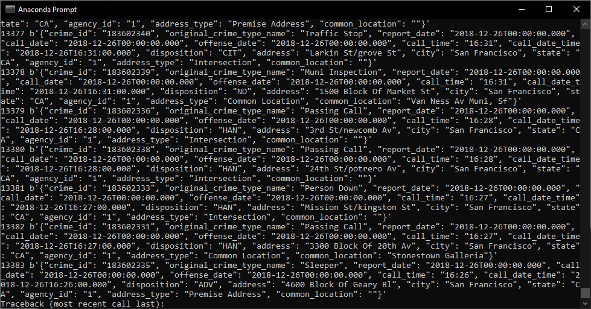

# SF-Crime-Statistics-with-Spark-Streaming
Statistical analyses of San Francisco crime incidents using Apache Spark Structured Streaming.

### Development Environment
You may choose to create your project in the workspace we provide here, or if you wish to develop your project locally, you will need to set up your environment properly as described below:

* Spark 2.4.3
* Scala 2.11.x
* Java 1.8.x
* Kafka build with Scala 2.11.x
* Python 3.6.x or 3.7.x

### Streaming data output through consumer

